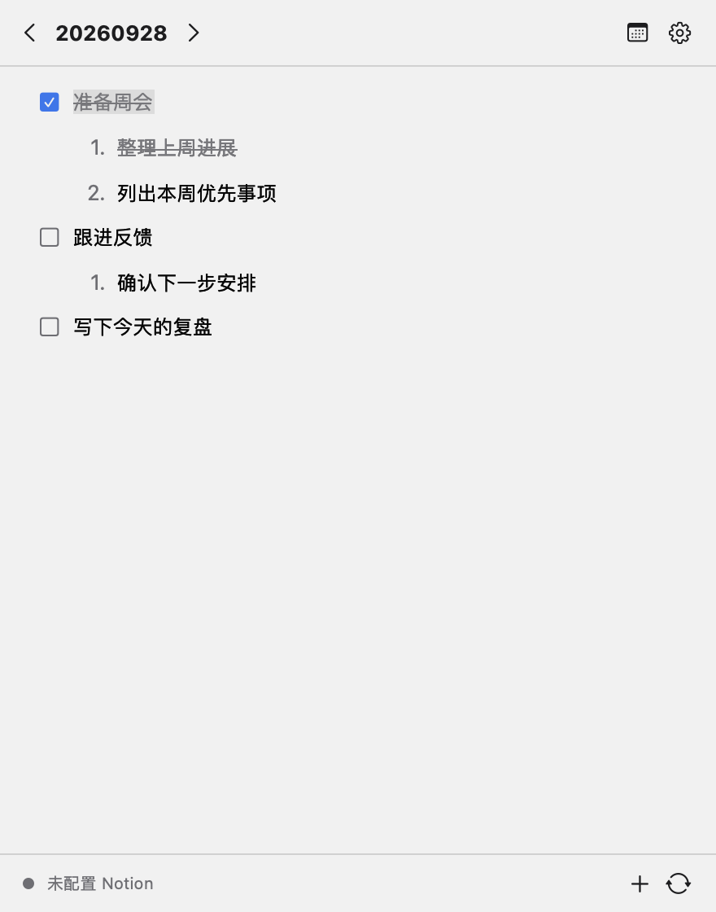

# Local Note

[简体中文](README.zh-CN.md) · English

**Local Note is an offline-first macOS menu bar work log. Capture daily tasks, check them off, and revisit past days.**

## Download and status

Download the [v0.2.0 macOS ZIP](https://github.com/Sealdot/app-local-note/releases/download/v0.2.0/LocalNote-macOS.zip). [Release notes and SHA-256 checksum](https://github.com/Sealdot/app-local-note/releases/tag/v0.2.0).

> **Early MVP · primarily Chinese UI · ad-hoc signed, not Apple notarized.** macOS may block the first launch. See [installation requirements and first launch](docs/installation.md#installation).

## See a workday

*Native app view with fictional tasks. Click for full size. [Screenshot source](docs/readme-media.md).*

## Three ways it helps

- **Capture without leaving your work.** Open the menu bar popover and write in today's outline, including when offline.
- **Turn a task into steps.** Use checkboxes and numbered children; copy and paste outline rows with their hierarchy and completion state intact.
- **Return to what you did.** Pick a date from the month calendar to reopen its record. Day colors reflect completed checkbox counts, not a productivity score.

## First use

1. Open `LocalNote.app` and click the checklist icon in the **macOS menu bar**. There is no Dock icon or main document window.
2. Click **+**, type `准备周会` (prepare the weekly meeting), and press Return to add another task. No Notion account or token is needed.
3. Check off the first task. Click the calendar button, then select today's date to return to its outline.

**Expected result:** close and reopen the popover; today's text and checked state remain. Without Notion configured, the footer can show `未配置 Notion` or `仅本地`; the record is still saved locally. [Keyboard controls, calendar, and appearance settings](docs/user-guide.md).

**Local privacy:** records and sync snapshots are unencrypted JSON under `~/Library/Application Support/LocalNote/`. Back them up yourself; there is no built-in backup workflow. Appearance settings stay on this Mac. The current source includes no analytics or telemetry client. [Security policy](SECURITY.md).

## Optional Notion sync

Notion sync is an **optional, experimental integration**. Try it on a dedicated test page and keep a separate backup of any content you care about. Enter your own page ID/URL and integration token in Settings; the token is stored in macOS Keychain, and enabling sync sends page content to Notion.

Remote edits need manual refresh or reopening the popover. When both sides changed, choosing a version discards the other side's changes for that day; there is no automatic merge. Sync writes replace the page's Markdown, so edits elsewhere on the page made during sync can also be overwritten. [Setup, conflict choices, and overwrite safeguards](docs/user-guide.md#optional-notion-sync).

Local Note is an independent open-source project, unaffiliated with Notion Labs, Inc.

## Development docs

Start with the [build and verification guide](docs/development.md) and [contribution rules](CONTRIBUTING.md). Use [Issues](https://github.com/Sealdot/app-local-note/issues) for reproducible bugs and feature discussion; report credential exposure or data-loss vulnerabilities through [SECURITY.md](SECURITY.md).

[Architecture](docs/architecture.md) · [Test plan](docs/test-plan.md) · [Historical performance measurements](docs/performance.md) · [Milestones and deferred work](docs/implementation-plan.md) · [MIT license](LICENSE)

Public OAuth, webhook updates, collaborative merging, attachments/rich inline content, and notarized distribution remain deferred, with no promised release date.
